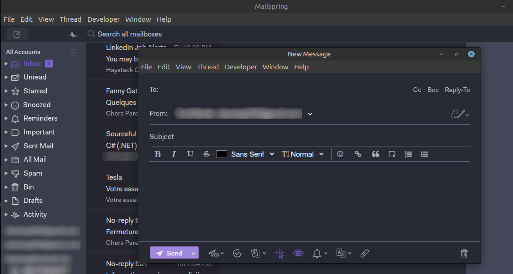

# Dracula Colorful for Mailspring

A vibrant dark theme for [Mailspring](https://www.getmailspring.com/), inspired by the Dracula Colorful theme for JetBrains Rider created by [Zihan Ma](https://plugins.jetbrains.com/vendor/1360f81c-0c2f-439f-afe0-fb7c1d041d7a).

Dracula Colorful combines a deep, comfortable background with bright accent colors to give your inbox a bold and modern look while keeping messages easy to scan.

## Installation

1. Download or clone this repository.
2. If you downloaded a ZIP archive, extract it.
3. Open Mailspring.
4. Choose **Install Theme...** from the Mailspring menu.
5. Select the extracted theme folder—the folder containing `package.json`.
6. Open **Preferences → Appearance → Change Theme...** and select **Dracula Colorful**.

> [!TIP]
> For the intended colors, turn off **Use system accent color** in **Preferences → Appearance**.

## Email appearance

Mailspring themes style the application interface, but email content can use its own colors. To adjust message rendering, open **Preferences → General → Reading → Email body appearance** and choose the mode that works best for you.